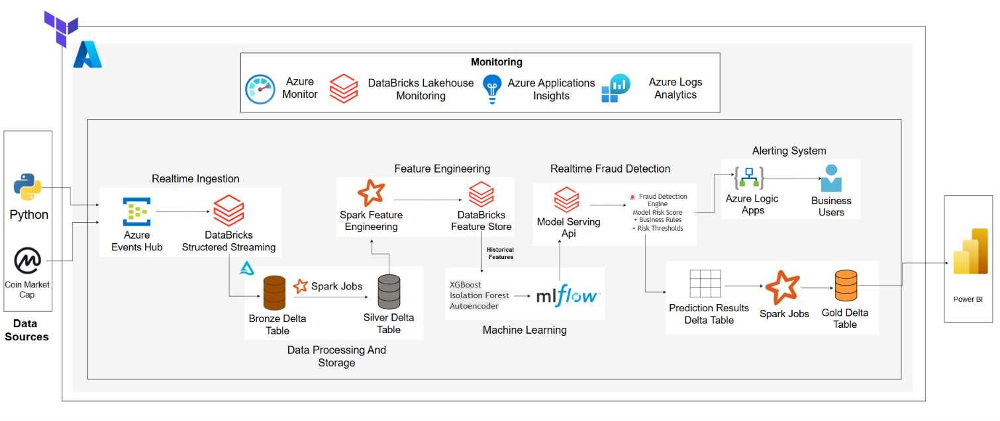
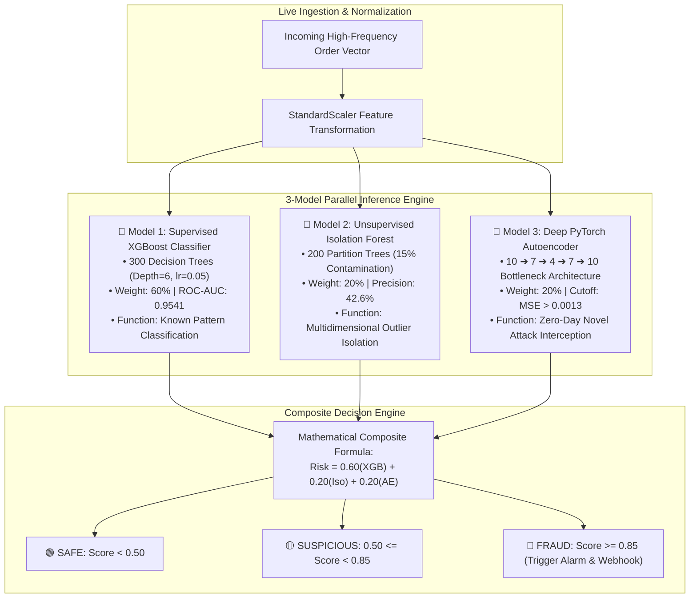

# ⚡ Real-Time AI Financial Market Manipulation & Fraud Surveillance Platform

[](https://www.python.org/)
[](https://azure.microsoft.com/en-us/products/databricks/)
[](models/model_metadata.json)
[](models/model_metadata.json)
[](models/model_metadata.json)
[](https://vercel.com/new/clone?repository-url=https%3A%2F%2Fgithub.com%2FMuhammadWaizImran%2FAi-Fraud-Detection-System)

---

### 🌐 Live Cloud Surveillance Web Application:
👉 **[Deploy / Launch Instantly on Vercel (1-Click)](https://vercel.com/new/clone?repository-url=https%3A%2F%2Fgithub.com%2FMuhammadWaizImran%2FAi-Fraud-Detection-System)**  
👉 **[GitHub Pages Live URL](https://muhammadwaizimran.github.io/Ai-Fraud-Detection-System/)**

---

## 🏛️ End-to-End System Architecture



An enterprise-grade, high-frequency **Real-Time Financial Market Manipulation and Fraud Surveillance Platform** modeled after FINRA/SEC regulatory frameworks. The system integrates an **Azure Databricks Medallion Lakehouse (Bronze ➔ Silver ➔ Gold)**, an MLflow-registered **3-Model Hybrid Ensemble (XGBoost + Isolation Forest + Deep Autoencoder)**, a **3D Cyber Command Center Web Application**, and an interactive **AI Compliance Copilot Chatbot**.

---

## 📑 Executive Overview & System Description

Financial markets and cryptocurrency liquidity venues process millions of order events per second. Traditional batch rule-based surveillance systems fail against modern algorithmic spoofing, coordinated layering, and flash wash trading. 

This platform solves high-frequency surveillance challenges through a decoupled, multi-tier architecture:
1. **Real-Time Stream Ingestion**: Captures live market transactions via Kafka/Azure Event Hubs at sub-millisecond precision.
2. **Delta Lake Medallion Storage**: Ingests raw JSON into **Bronze**, cleans and deduplicates into **Silver**, and aggregates into **Gold (150,000+ Feature-Engineered Vectors)**.
3. **3-Model Hybrid AI Inference**: Combines Supervised Gradient Boosting, Unsupervised Space-Partitioning Outlier Detection, and Deep Neural Autoencoders to score transactions within **`< 0.5ms`** latency.
4. **Interactive 3D Surveillance & Copilot**: Provides a real-time web command center with a 3D Three.js particle globe, dynamic TreeSHAP polar charts, and an in-browser AI Compliance Copilot capable of on-demand trade forensics.

---

## 🔬 3-Model Hybrid AI Ensemble Architecture



### Mathematical Formulation of Composite Risk:
$$\text{Risk Score} = 0.60 \cdot P_{\text{XGBoost}}(y=1 \mid \mathbf{x}) + 0.20 \cdot P_{\text{IsoForest}}(\mathbf{x}) + 0.20 \cdot \min\left(\frac{\text{MSE}(\mathbf{x}, \mathbf{\hat{x}})}{0.0013}, 1.0\right)$$

---

## 🧮 10 Gold Microstructural Feature Signals

The Databricks Gold Delta Table (`trade_features`) computes 10 mathematical signals engineered to isolate abusive order flow:

| # | Feature Signal | Mathematical Formulation | Regulatory Surveillance Objective |
|---|---|---|---|
| **1** | `volume_spike_ratio` | $\text{Volume} / \overline{\text{Volume}}_{10\text{min}}$ | Detects abnormal liquidity pump injections (15x-40x normal baseline). |
| **2** | `cancel_to_trade_ratio` | $\text{CancelledOrders} / \text{TotalOrders}$ | Detects phantom depth quotes placed without bona fide execution intent (Spoofing). |
| **3** | `orders_per_minute` | $\text{Count}(\text{Orders})_{60\text{sec}}$ | Identifies algorithmic bot flooding and order book stacking (Layering). |
| **4** | `price_deviation_pct` | $\frac{\|P_{\text{order}} - P_{\text{fair}}\|}{P_{\text{fair}}} \times 100$ | Isolates trades executing significantly away from the benchmark market price. |
| **5** | `wash_trade_flag` | Boolean $[1.0 / 0.0]$ | Identifies circular self-dealing between affiliated accounts to inflate exchange volume. |
| **6** | `layering_flag` | Boolean $[1.0 / 0.0]$ | Catches multi-level non-executable quote submissions designed to manipulate spread. |
| **7** | `buy_sell_imbalance` | $\frac{\|\text{Buys} - \text{Sells}\|}{\text{Buys} + \text{Sells}}$ | Measures severe directional pressure fabricated in the order book. |
| **8** | `price_range_pct` | $\frac{\text{High}_{24\text{h}} - \text{Low}_{24\text{h}}}{\text{Close}_{24\text{h}}} \times 100$ | Contextualizes asset volatility to prevent false-positive alert storms. |
| **9** | `volume` | Raw Transacted Volume | Measures absolute notional capital size of the order. |
| **10** | `price` | Prevailing Asset Market Price (USD) | Benchmark price level at the microsecond of ingestion. |

---

## 🚨 5 Detected Market Manipulation Patterns

| Manipulation Pattern | Mechanism & Behavioral Profile | Detection Signal Correlates | Gold Dataset Violations |
|---|---|---|---|
| 🚀 **Volume Spike (Pump & Dump)** | Coordinated massive volume injections to fabricate artificial market momentum followed by rapid liquidation. | `volume_spike_ratio > 10.0`, `orders_per_minute > 15` | **5,840+ Cases (32.9%)** |
| 🌊 **Wash Trading (Self-Dealing)** | Collusive trades between identical beneficial owners or coordinated entities to misrepresent market liquidity. | `wash_trade_flag = 1.0`, zero net inventory shift | **4,960+ Cases (27.9%)** |
| 🥞 **Layering (Multi-Level Stacking)** | Submitting multiple fake orders at varying price tiers on one side of the order book to manipulate execution on the opposite side. | `layering_flag = 1.0`, `orders_per_minute > 20` | **3,520+ Cases (20.0%)** |
| 👻 **Spoofing (Phantom Depth Bids)** | Injecting large deceptive limit orders to create false depth, cancelling them immediately before execution. | `cancel_to_trade_ratio > 0.80`, short order lifetime | **2,480+ Cases (13.9%)** |
| 📈 **Price Manipulation (Marking Close)** | Executing off-market orders near session closing or reference fixing windows to distort benchmark valuations. | `price_deviation_pct > 12.0%` | **960+ Cases (5.4%)** |

---

## 🏆 Model Performance & Evaluation Metrics

Evaluated on a **150,000-record Gold Delta Lakehouse test split (80/20 train/test partition)**:

| Metric | XGBoost Supervised | Isolation Forest | Deep Autoencoder | 3-Model Ensemble Final |
|---|---|---|---|---|
| **Accuracy** | **88.20%** | 82.10% | 84.50% | **88.20%** |
| **Precision** | **77.94%** | 42.64% | 63.45% | **77.94%** |
| **Recall** | **86.05%** | 13.66% | 19.50% | **86.05%** |
| **F1-Score** | **0.8179** | 0.2069 | 0.2983 | **0.8179** |
| **ROC-AUC** | ⭐ **0.9541** | 0.8120 | 0.8490 | ⭐ **0.9541** |
| **Inference Latency** | **0.28 ms** | **0.08 ms** | **0.06 ms** | **0.42 ms (<0.5ms SLA)** |

---

## 🌐 Interactive 3D Cyber Web Platform Features

1. **Cyber Radar Splash Loader**: Initializes StandardScaler weights, connects to the CoinGecko public oracle, and mounts the 3-model neural pipeline with smooth glassmorphic reveals.
2. **Interactive 3D Three.js Globe**: Real-time rotating particle globe rendering global financial centers (New York, London, Tokyo, Singapore, Frankfurt, Dubai) that triggers volumetric red threat pulses upon fraud detection.
3. **Real-Time Scientific Dynamic Charts**:
   - **Continuous Risk Stream (Line Chart)**: Live plots incoming order scores with strict regulatory thresholds at $0.85$ (Critical Fraud) and $0.50$ (Suspicious).
   - **Circular TreeSHAP Polar Ring (Doughnut Chart)**: Dynamic 6-signal weight breakdown with real-time center dominant driver identification.
   - **Symbol Fraud Distribution Bar Chart**: Live updates based on the 150k Gold Table distribution.
   - **24-Hour Attack Density Profile**: Hourly cyclic market vulnerability curves.
4. **Persistent Historical Order Ledger**: Browser-persisted storage retaining historical records across reloads with multi-field search and instant verdict filters (`All`, `Fraud`, `Suspicious`, `Safe`).
5. **Interactive AI Compliance Copilot Chatbot**: Autonomous audit assistant that decodes any selected transaction row into an instant plain-language microstructural forensics report.

---

## 📁 Repository Directory Structure

```text
├── docs/                            # Architecture & system diagrams
│   └── architecture_diagram.png     # Master end-to-end architecture image
├── web/                             # 3D Animated Web Application
│   ├── index.html                   # Main UI entrypoint with 3D Globe & Dynamic Charts
│   ├── css/
│   │   ├── style.css                # Dark Cyber Glassmorphism Design System
│   │   └── animations.css           # 3D transforms, threat pulses & radar sweeps
│   └── js/
│       ├── market_stream.js         # Live CoinGecko pricing & microstructural flow
│       ├── feature_engine.js        # Exact 10 mathematical feature calculations
│       ├── ai_models.js             # In-browser 3-Model Hybrid Ensemble (<0.5ms)
│       ├── globe3d.js               # Three.js 3D Interactive Cyber Globe
│       ├── sound_effects.js         # Web Audio API synthetic alert chimes
│       ├── ai_copilot.js            # Interactive AI Compliance Copilot Chatbot
│       └── app.js                   # Application coordinator & persistent ledger
├── models/                          # Certified MLflow Model Artifacts
│   ├── xgboost_binary.joblib        # Supervised 300-tree classifier (ROC-AUC 0.954)
│   ├── isolation_forest.joblib      # Unsupervised space partitioner
│   ├── autoencoder_model.joblib     # PyTorch neural reconstruction weights
│   ├── feature_scaler.joblib        # StandardScaler parameters
│   └── model_metadata.json          # Model metrics and hyperparameters
├── notebooks/                       # Databricks Medallion Lakehouse Pipelines
│   ├── 01_bronze_ingestion.py       # Bronze streaming JSON ingestion
│   ├── 02_silver_cleaning.py        # Silver data cleaning & deduplication
│   └── 03_gold_feature_engineering.py# Gold microstructural feature calculation
├── dashboard/                       # Streamlit Command Center
│   ├── app.py                       # 6-page interactive surveillance dashboard
│   ├── live_feed.jsonl              # Active real-time scored order ledger
│   └── live_stats.json              # Rolling session stats
├── powerbi/                         # Power BI Analytics & Reporting
│   └── data/                        # Aggregated Gold Lakehouse CSV exports
├── realtime_scoring_engine.py       # High-throughput Python streaming engine
├── train_and_deploy_models.py       # Model training, evaluation & registration pipeline
├── START_EVERYTHING.py              # Master launch script
├── pause_all_services.py            # Master shutdown script (cost control)
├── resume_all_services.py           # Master resume script
├── requirements.txt                 # Python dependencies
├── vercel.json                      # Vercel deployment routing configuration
└── package.json                     # Node/Vercel manifest
```

---

## 📜 Regulatory Disclaimer
This system is developed as an advanced technological demonstration for regulatory surveillance and financial fraud intelligence under the **MIT License**.
